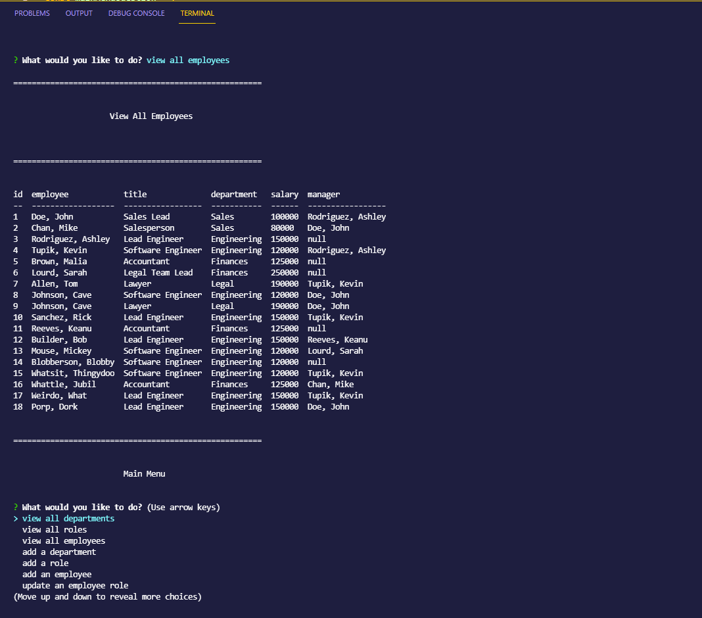

# EMPLOYEE TRACKER 
## Description
A CLI application for managing a database of employees.

## Table of Contents
- [Installation](#Installation)
- [Usage](#Usage)
- [Questions](#Questions)
- [Code-of-Conduct](#Code-of-Conduct)
- [License](#License)

## Installation
To install this application, follow the below instructions:
    - First, install Node.js. It's a javascript engine that runs on your computer instead of the browser, and necessary for the application to function. This application was created on Node v14.17.1.
    - Second, clone/download this project from its GitHub repository to a directory of your choosing.
    - Third, open your terminal -- command line, powershell, et cetera -- and navigate to the directory into which you downloaded the application.
    - Fourth, enter the command 'npm i', which will download and install all of the necessary dependencies for the application to function.
    - Finally, enter the command 'npm start' to begin using the application!

## Usage
This application has limited functionality and a fairly restricted interface. It is primarily for use to read from and write to an employee database, and cannot be used beyond that scope without modification.

## Questions
If you need to reach me, my GitHub username (and a link to my profile page) is [RookiePrime](https://github.com/RookiePrime) and my email address is [kiefer_8@hotmail.com](mailto:kiefer_8@hotmail.com).

## Code-of-Conduct
### Contributor Covenant
We as members, contributors, and leaders pledge to make participation in our
community a harassment-free experience for everyone, regardless of age, body
size, visible or invisible disability, ethnicity, sex characteristics, gender
identity and expression, level of experience, education, socio-economic status,
nationality, personal appearance, race, caste, color, religion, or sexual identity
and orientation.

We pledge to act and interact in ways that contribute to an open, welcoming,
diverse, inclusive, and healthy community.
[Click here to read the full code of conduct](https://www.contributor-covenant.org/version/2/0/code_of_conduct/)

## License
This software is offered under the MIT License. For more information on conditions of use, [follow this link.](https://opensource.org/licenses/MIT).